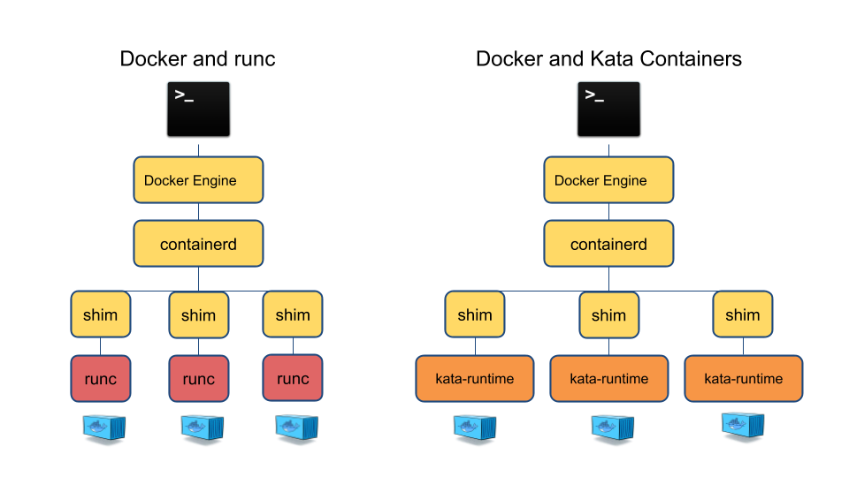
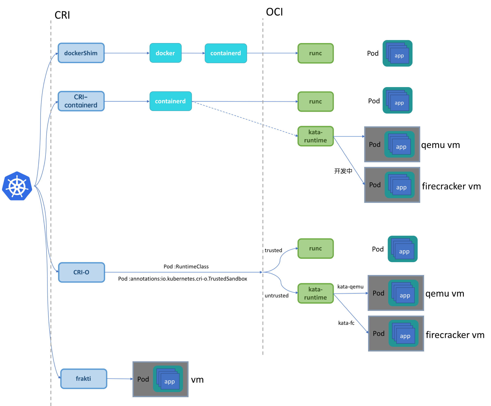
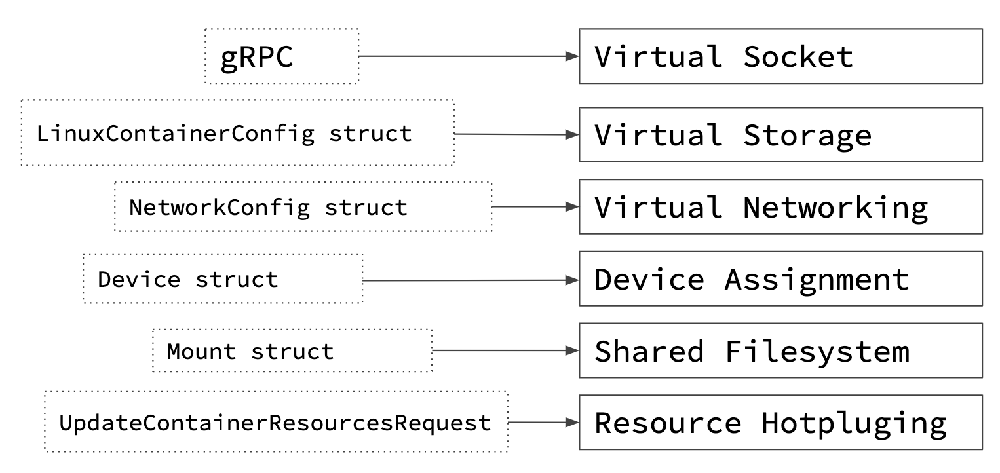

##  Kata Containers 概述

Kata Containers 主要提供 container runtime 和 CRI shim。在它们背后还有一个友好的 CRI API。

 [Kata Containers runtime (`kata-runtime`)](https://github.com/kata-containers/runtime) 兼容 [OCI](https://github.com/opencontainers) [runtime specification](https://github.com/opencontainers/runtime-spec)，它是与 runc 同级别的东西。所以可以用于替换 docker 的 默认运行时 runc。

CRI shim 则通过 [CRI-O*](https://github.com/kubernetes-incubator/cri-o) and [Containerd CRI Plugin*](https://github.com/containerd/cri) 实现支持  [Kubernetes* Container Runtime Interface (CRI)](https://github.com/kubernetes/community/blob/master/contributors/devel/sig-node/container-runtime-interface.md)。



k8s 与 CRI、OCI 的关系：



 [`containerd-shim-kata-v2` (shown as `shimv2` from this point onwards)](https://github.com/kata-containers/runtime/tree/master/containerd-shim-v2) 是另一个容器切入点，实现了 kata 的  [Containerd Runtime V2 (Shim API)](https://github.com/containerd/containerd/tree/master/runtime/v2) 


容器进程由[agent](https://github.com/kata-containers/agent)产生，`agent` 作为守护进程运行在虚拟机内部。`kata-agent`使用` VIRTIO 串口`或 `VSOCK 接口`（使用的是 qemu 在主机上暴露出来的 socket 文件）在虚拟机中运行一个 gRPC 服务。`kata-runtime`使用 gRPC 协议与 agent 通信。该协议还用于在容器和管理引擎之间传输 I/O 流（stdout, stderr, stdin）。

对于任何一个容器，其`初始进程、以及所有的在容器内部执行的命令、和相关的 I/O 流`，都需要通过 VIRTIO 串口或 VSOCK 接口。在使用 VIRTIO 串口时，每个虚拟机都会启动一个 [Kata Containers proxy (`kata-proxy`)](https://github.com/kata-containers/proxy) 去处理多路复用和解多路复用 这些命令和流（使用 shimv2 的情况除外）。

在主机上面，每个容器进程的移除都通过一个位于 container 堆栈高层的 `reaper` 进行处理。在 Docker 或 containerd 中是 `containerd-shim`。对于 Kata Containers 来说，进程是运行在虚拟机内部的，所以 reaper 不能监视、控制或回收它们。旧版解决方案：`kata-runtime`通过在 reaper 与 `kata-proxy` 之间创建一个额外的[shim process (`kata-shim`)](https://github.com/kata-containers/shim)进程来解决该问题。一个`kata-shim`实例既可以转发 信号和`stdin`流 到虚拟机中的容器进程，又可以通过 reaper 传递 `stdout`和`stderr`流 的堆栈到 CRI shim 或 Docker 。`kata-runtime`为 每个容器和每条接收到的要运行的 OCI 命令 创建一个`kata-shim`守护进程。

从 Kata Containers 1.5 开始，`shimv2`整合了 `reaper `、`kata-runtime `、`kata-shim`及`kata-proxy` 的功能。所以使用`shimv2`时这些进程就不会再出现了。

## 虚拟化

Kata容器在传统名称空间容器提供的隔离之上创建了第二层隔离。硬件虚拟化接口是此附加层的基础。Kata 将启动一个轻量级虚拟机，并使用 guest 的 Linux 内核创建一个容器工作负载，或者在多容器 pod 的情况下创建工作负载。

本文档描述了 Kata Containers 如何将容器技术映射到虚拟机技术，以及如何在 Kata 支持的多个 hypervisors 和虚拟机监视器中实现这一点。

### 将容器概念映射到虚拟机技术

根据 kubernetes 的 CRI API， Kata Containers 必须提供一些结构体，然后讲这些结构体进一步映射到虚拟机接口所需的设备：



最终，这些概念映射到特定的准虚拟化设备或虚拟化技术：


每个 Hypervisor 或 VMM 在如何或是否处理其中的每一个方面各不相同。

### 对于 Hypervisor 和 VMM 的支持

 Kata Containers 支持多种 虚拟机监视器（VMM）和 hypervisor：

- [ACRN hypervisor](https://projectacrn.org/)
- [Cloud Hypervisor](https://github.com/cloud-hypervisor/cloud-hypervisor)/[KVM](https://www.linux-kvm.org/page/Main_Page)
- [Firecracker](https://github.com/firecracker-microvm/firecracker)/KVM
- [QEMU](http://www.qemu-project.org/)/KVM

#### QEMU/KVM

使用 QEMU 可以与 kubernetes 完全兼容。

根据主机架构， Kata Containers 支持多种虚拟机类型，例如 `pc` and `q35` on x86 systems, `virt` on ARM systems and `pseries` on IBM Power systems。默认的类型是 `pc`。可以通过编写运行时配置文件（ [`configuration`](https://github.com/kata-containers/documentation/blob/master/design/architecture.md/#configuration) ）更改虚拟机类型及它的加速器（ [`Machine accelerators`](https://github.com/kata-containers/documentation/blob/master/design/virtualization.md#machine-accelerators) ）。

使用的设备及特性：

- virtio VSOCK or virtio serial
- virtio block or virtio SCSI
- virtio net
- virtio fs or virtio 9p (recommend: virtio fs)
- VFIO
- hotplug
- machine accelerators

Kata container 中使用 machine accelerators 和 hotplug 来管理资源约束、改进引导时间和减少内存占用。

##### Hotplug 设备

 Kata Containers 使用最少的资源启动虚拟机，随着容器启动的进行，设备会热插拔到VM。支持的热插拔设备有以下几种：

- Virtio block
- Virtio SCSI
- VFIO
- CPU

#### Firecracker/KVM

有一个非常有限的设备模型，提供更少的占用。所以只支持部分 CRI API 。Firecracker 的缺点：

- 不支持文件系统共享，所以只支持块存储设备；
- 不支持设备热插拔；
- 不支持 VFIO；
- 不支持在启动后更新容器资源；
- 不支持设备直连。

使用的设备：

- virtio VSOCK
- virtio block
- virtio net

#### Cloud Hypervisor/KVM

与 Firecracker 类似，但与其相比 Cloud Hypervisor 配置提供更好的兼容性，但代价是暴露更多设备：文件系统共享和直接设备分配。

截至 Kata Containers 1.10：

- 不支持设备热插拔；
- 不支持在启动后更新容器资源；
- 不支持利用基于 块 的卷；
- 不支持直接设备分配。

使用的设备：

- virtio VSOCK
- virtio block
- virtio net
- virtio fs

## Guest 内容

 hypervisor 将启动一个虚拟机，该虚拟机包括一个最小的 guest kernel 和 一个 guest image。

### Guest kernel

kernel 被传送给  hypervisor 并用于启动虚拟机。 Kata Containers 基于最新的 Linux 内核对其进行高度优化，只提供容器要求的服务。

### Guest image

 Kata Containers 支持基于 initrd 和 rootfs 的最小客户映像。

#### Root filesystem image

默认的 root filesystem image (有时称为`mini O/S`)是一个基于 [Clear Linux](https://clearlinux.org/) 的高度优化的容器引导系统。它提供了一个极小的环境，并有一个高度优化的引导路径。

在 mini O/S 上下文中运行的唯一服务是 init 守护进程(systemd)和 [Agent](#agent)。用户希望运行的实际工作负载（workload）是使用 libcontainer 创建的，创建容器的方式与 runc 相同。

例如，当运行 `docker run -ti ubuntu date` 时：

- hypervisor 使用 kernel 启动 mini O/S image。
- 运行在 mini-OS 上下文中的 `systemd `会在同一个上下文中启动  `kata-agent` 。
- agent 会创建一个新的封闭的上下文运行指定的命令（date）。
- agent 首先将 root filesystem 设置为预期的 Ubuntu* root filesystem，然后在新的上下文执行命令。

#### Initrd image

压缩的 `cpio(1)` 文件，从 rootfs （被载入内存并作为 linux 启动过程的一部分被使用）创建。

在 initrd 上下文中运行的唯一服务是 作为init 守护进程的 [Agent](#agent)。用户希望运行的实际工作负载（workload）是使用 libcontainer 创建的，创建容器的方式与 runc 相同。

## Agent

[`kata-agent`](https://github.com/kata-containers/agent) 是运行在 guest 中的管理进程，它管理容器和在容器中运行的进程。

 `kata-agent` 的执行单元是 `sandbox`。 `kata-agent` 沙箱是由一组名称空间(NS、 UTS、 IPC 和 PID)定义的容器沙箱。`kata-runtime` 可以在每个 VM 中运行多个容器，以支持需要在一个 pod 中运行多个容器的容器引擎。**使用 docker 的时候，一个 pod 中只会创建一个 容器。**

 `kata-agent` 通过 gRPC 与其它的 kata 组件通信。

 `kata-agent` 使用  [`libcontainer`](https://github.com/opencontainers/runc/tree/master/libcontainer)（Libcontainer 用于创建具有名称空间、 cgroups、功能和文件系统访问控制的容器。它允许您管理容器的生命周期，在创建容器之后执行其他操作。） 管理容器的生命周期。这样， `kata-agent`  就可以重用  [`runc`](https://github.com/opencontainers/runc) 使用的大部分代码。

## Runtime

`kata-runtime` 是一个兼容 OCI 的容器运行时，负责处理所有 [the OCI runtime specification](https://github.com/opencontainers/runtime-spec) 指定的命令及启动 `kata-shim` 实例。

`kata-runtime` 大量利用了 [virtcontainers](https://github.com/containers/virtcontainers) 项目，该项目提供了一个通用的、与运行时规范无关的、硬件虚拟化的容器库。

### Configuration

运行时使用`TOML`格式的配置文件（ `configuration.toml`），位于`/usr/share/defaults/kata-containers`目录下，该目录还包含了其它设置。

### 重要的 COI 命令

本节描述了`kata-runtime` 如何处理大部分重要的 OCI 命令。

参见：https://github.com/kata-containers/documentation/blob/master/design/architecture.md#significant-oci-commands

## Proxy

与 虚拟机 通信使用的是 `virtio-serial` ，如果主机内核比 v4.8 新，可以使用`vsock`（virtual socket）。默认使用前者。

一个虚拟机里面很可能会运行多个容器进程。在使用 `virtio-serial` 的情况下，与每个进程关联的 I/O 流需要在主机上被多路复用和解多路复用。使用`vsock`的情况下，该组件可选。

 `kata-proxy` 是一个进程，可为与 VM 关联的多个 kata-shim 和 kata-runtime 客户端提供对 VM kata-agent 的访问。它的主要作用是在`kata-shim`和 `kata-agent` 直接转发 I/O 流及信号。 `kata-proxy` 通过`kata-runtime`在生成`kata-proxy`时提供的Unix域套接字连接到`kata-agent`。

## Shim

shim 是一个容器进程回收器（reaper），例如 Docker 的 `containerd-shim` or CRI-O 的 `conmon`，它的设计是基于这样一个假设：它可以监视和回收实际的容器进程。因为 reaper 运行在主机上，所以它不能直接监视一个运行在虚拟机上的进程。对于 Kata Containers ，`kata-shim` 充当了 reaper 可以监视的容器进程。于是`kata-shim`需要处理所有的容器 I/O 流（stdin、stdout、stderr）并且转发所有的 reaper 绝对发送到容器进程的信号。

`kata-shim` 的主要作用：

- 通过一个 Unix 域 socket 连接到`kata-proxy`。在`kata-runtime` 产生`kata-shim` 的时候根据 `containerID` 和 `execID` 从前者传递给后者。这两个 ID 被用于确认真正地容器进程。
- 使用 gRPC `WriteStdin` gRPC API 把 stdin 流从 reaper 转发到  `kata-proxy` 。
- 从容器进程读取 stdout、stderr。
- 使用 `SignalProcessRequest` API 从 reaper 转发信号到 `kata-proxy` 。
- 监视 terminal 的改变并使用 gRPC `TtyWinResize` API 将它们转发到 `kata-proxy` 。

## Networking

容器通常位于它们自己的(可能是共享的)网络命名空间中。在容器生命周期的某个时刻，容器引擎将设置该命名空间，以将容器添加到与主机网络隔离但又在容器之间共享的网络中。

为此，容器引擎通常会将虚拟以太网（[veth](https://segmentfault.com/a/1190000009251098?utm_source=tag-newest)）对的一端添加到容器网络名称空间中。把另一端添加到主机网络命名空间。

这是一种非常依赖命名空间的方法。但是很多 hypervisor 都不能处理 `veth` 接口；所以通常为 VM 连接创建 `TAP` 接口。

为了克服经典容器引擎与虚拟机之间的不兼容问题，`kata-runtime` 网络使用 `MACVTAP `透明地将 `veth` 接口和 `TAP` 接口连接起来。


 Kata Containers 同时支持  [CNM](https://github.com/docker/libnetwork/blob/master/docs/design.md#the-container-network-model) 和 [CNI](https://github.com/containernetworking/cni) 进行网络管理。

### 使用 CNM 设置 runtime 网络


1. 读取 `config.json`
2. 创建 network namespace（通过 `ip netns` 添加的 ns 在 **/var/run/netns/** 下面）
3. 调用 `prestart` hook (从 netns 内部)
4. 扫描 netns 内部的网络接口，并获取由 prestart 钩子创建的接口的名称
5. 创建 bridge, TAP, 然后把它们全都与先前创建的网络接口连接起来

## Storage

容器的工作负载（workload）通过 [9pfs](https://www.kernel.org/doc/Documentation/filesystems/9p.txt) 与虚拟化环境共享。设备映射器存储驱动程序是一种特殊情况。 驱动程序使用专用的块设备而不是格式化的文件系统，并且在块级别而不是文件级别运行。此技术用于直接使用底层块设备，而不是容器 root file system 的 overlay file system。块设备映射到 overlay 的顶部读写层。与使用 9pfs 共享容器文件系统相比，这种方法提供了更好的 I/O 性能。

上述的方法在复制文件方面会有限制。当使用 `docker cp` 时不能将文件从主机复制到容器，这会导致问题。

```
docker cp [OPTIONS] CONTAINER:SRC_PATH HOST:DEST_PATH
docker cp [OPTIONS] HOST:SRC_PATH CONTAINER:DEST_PATH
```

Kata Containers 支持块存储设备的热插拔。

用户可以在容器内部使用`mount(8)`查看是否使用了 设备映射器块设备 作为它的 rootfs。如果使用了块设备，那么`/`会被挂载到`/dev/vda`。

可以设置配置文件`/usr/share/defaults/kata-containers/configuration.toml`中的`disable_block_device_use`字段关掉块设备直接挂载功能，转而使用 9pfs。

## Kubernetes 支持

 Kata Containers 是一个被 CRI-O and Containerd CRI Plugin 官方支持的 runtime 。但是，由于 Kubernetes 的执行单元是 pod ，一个 pod 里面可能会运行多个容器，所以  Kata Containers runtime 需要获取一些额外的信息来无缝整合 Kubernetes 。

### 问题描述

如果没有来自 CRI 运行时的额外元数据，Kata Containers 运行时将为每个 pod 和 pod 中的每个容器创建一个虚拟机。然而，考虑到这些虚拟机的资源（如网络或 PID）需要共享，这项任务非常复杂。

对于 Kubernetes 使用 Kata Containers 作为 runtime 的情况来说，挑战就变成了：1. 何时为 pod 创建一个完整的虚拟机；2. 何时在前一步创建好的虚拟机中创建一个容器。在这两种情况下，都将使用非常相似的参数来调用它，因此它需要 Kubernetes CRI 运行时的帮助才能区分 pod 创建请求和容器创建请求。

